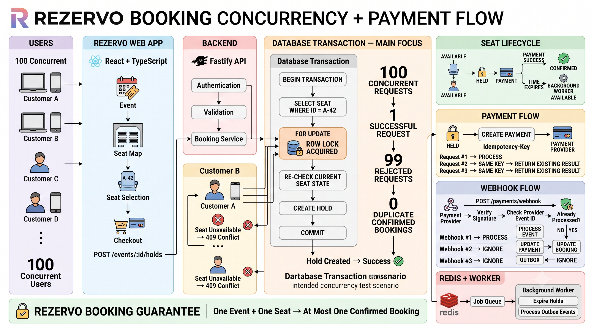

<div align="center">

  

  <br />
  <br />

  # 🎟️ REZERVO
  **High-Concurrency Event Booking & Payment Platform**

  []()
  []()
  []()
  []()
  []()
  []()

  > **Engineering Philosophy:** Don't just make the happy path work. Build the system so the important failure modes are difficult or impossible to produce. Prioritize engineering depth and system reliability over feature breadth.

</div>

<br />

## 🎯 The Core Problem: The Seat-Booking Race Condition

REZERVO is a production-oriented event booking platform built around one specific engineering challenge: **preventing double-booking under concurrent requests.**

When hundreds of users attempt to book the same seat at nearly the same time, the system must process the requests safely and ensure that only one confirmed booking can exist for that event and seat.

### 🔒 Core Invariant

> **ONE EVENT + ONE SEAT = AT MOST ONE CONFIRMED BOOKING**

This invariant is protected through application logic, PostgreSQL transactions, row-level locking, and database constraints.

---

## 🏗️ System Architecture

```text
                         ┌──────────────────┐
                         │      USER        │
                         │ Browser / Client │
                         └────────┬─────────┘
                                  │ HTTPS
                                  ▼
                         ┌──────────────────┐
                         │   React Web App  │
                         │ TypeScript/Vite  │
                         └────────┬─────────┘
                                  │ REST API
                                  ▼
                         ┌──────────────────┐
                         │    Fastify API   │
                         │ Node.js + TS     │
                         └───────┬───┬──────┘
                                 │   │
                    ┌────────────┘   └────────────┐
                    ▼                             ▼
             ┌─────────────┐              ┌─────────────┐
             │ PostgreSQL  │              │    Redis    │
             │ Source of   │              │ Cache /     │
             │ truth       │              │ Job queues  │
             └─────────────┘              └──────┬──────┘
                                                 │
                                                 ▼
                                        ┌────────────────┐
                                        │ Worker Process │
                                        │ Background     │
                                        │ Jobs           │
                                        └────────────────┘

                         ┌──────────────────┐
                         │ Payment Provider │
                         │     Webhooks     │
                         └────────┬─────────┘
                                  │
                                  ▼
                             Fastify API
```

---

## 🖼️ System Architecture

### Complete System Architecture



### Booking Concurrency & Payment Flow


The architecture separates the web application, API, database, cache/queue layer, background processing, and payment integration.

---

## 🛠️ Technology Stack

| Layer | Technology | Purpose |
|---|---|---|
| Frontend | React + TypeScript | Web application |
| Build Tool | Vite | Frontend development and builds |
| Styling | Tailwind CSS | User interface styling |
| Backend | Node.js + Fastify | REST API |
| Validation | Zod | Request and data validation |
| Database | PostgreSQL | Transactional source of truth |
| Cache / Queue | Redis | Caching and background jobs |
| Worker | Node.js | Background processing |
| Containers | Docker | Local and deployment environments |
| Testing | Unit, Integration & Load Tests | Reliability and correctness |
| Payments | Payment Provider Sandbox | Payments and webhooks |

---

## 🗄️ Database Schema

PostgreSQL is the source of truth for users, events, seats, holds, bookings, and payments.

### Core Tables

```text
users
events
seats
holds
bookings
payments
webhook_events
outbox
```

### Relationships

```text
Users
  │
  └───< Bookings

Events
  │
  └───< Seats
          │
          ├───< Holds
          │
          └───< Bookings

Bookings
  │
  └───< Payments
```

### `users`

Stores registered users and authentication information.

### `events`

Stores event details such as title, venue, schedule, and sales availability.

### `seats`

Stores individual seats belonging to an event.

### `holds`

Stores temporary reservations, the user holding the seat, and the expiration time.

### `bookings`

Stores booking records and their current status.

### `payments`

Stores payment attempts, idempotency keys, provider references, amounts, and payment status.

### `webhook_events`

Stores payment-provider events so duplicate webhook deliveries can be detected safely.

### `outbox`

Stores events that need to be processed asynchronously.

---

## 🔄 Booking Lifecycle

A seat moves through a controlled booking lifecycle:

```text
┌─────────────┐
│  AVAILABLE  │
└──────┬──────┘
       │
       │ Create Hold
       ▼
┌─────────────┐
│     HELD    │
└──────┬──────┘
       │
       ├─────────────── Expiry ──────────────► AVAILABLE
       │
       │ Successful Payment
       ▼
┌─────────────┐
│  CONFIRMED  │
└─────────────┘
```

A temporary hold gives the user time to complete payment without allowing another user to claim the same seat.

---

## 🔐 Concurrency Control

The most important part of REZERVO is protecting the seat from concurrent booking requests.

### PostgreSQL Row-Level Locking

Competing requests operate inside a transaction:

```sql
BEGIN;

SELECT status
FROM seats
WHERE id = $1
FOR UPDATE;

-- Re-check the current seat state.
-- Create the hold or booking when available.

COMMIT;
```

`FOR UPDATE` locks the specific seat row until the transaction completes.

This means requests competing for the same seat are serialized, while requests for different seats can continue independently.

### Database-Level Protection

The database will also enforce the booking invariant with a uniqueness constraint.

The application should prevent incorrect bookings, but the database should provide the final protection against duplicate confirmed bookings.

---

## 💳 Payment Idempotency

Payment requests can be retried because of network failures, client retries, or provider behavior.

REZERVO uses an idempotency key for each booking/payment attempt.

```text
Payment Request #1  → Process
Payment Request #2  → Existing result
Payment Request #3  → Existing result
```

A repeated request must not create another booking or duplicate payment effect.

---

## 🔁 Webhook Handling

Payment providers may deliver the same webhook more than once.

REZERVO records the provider event ID and processes each event only once.

```text
Webhook #1 → Process
Webhook #2 → Duplicate → Ignore
Webhook #3 → Duplicate → Ignore
```

Webhook signatures will also be verified before processing.

---

## ⏱️ Seat Holds & Expiration

A seat is temporarily held while the user completes payment.

Each hold contains an expiration timestamp:

```text
AVAILABLE
    ↓
HELD
    ↓
Payment succeeds → CONFIRMED
    │
    └── Expiry → AVAILABLE
```

Expired holds will be handled in two ways:

1. Reads check whether `expires_at` has passed.
2. A background worker cleans up expired holds.

This prevents expired reservations from permanently blocking inventory.

---

## 🌐 API Design

### Authentication

```text
POST /auth/register
POST /auth/login
GET  /auth/me
```

### Events

```text
GET  /events
GET  /events/:id
```

### Seats

```text
GET /events/:id/seats
```

### Holds

```text
POST   /events/:id/holds
DELETE /holds/:id
```

### Bookings

```text
POST /bookings
GET  /bookings/:id
GET  /me/bookings
```

### Payments

```text
POST /payments/webhook
GET  /payments/:id
```

### Administration

```text
POST /events
POST /events/:id/seats
```

The request and response contracts will be documented as the API is implemented.

---

## 🧪 Testing Strategy

REZERVO will test both normal functionality and failure scenarios.

### 1. Concurrent Booking Test

```text
100 concurrent requests
        ↓
     Same event
        ↓
     Same seat
        ↓
1 successful request
99 rejected requests
0 duplicate confirmed bookings
```

### 2. Payment Retry Test

```text
Same payment request × 3
        ↓
1 payment effect
1 booking
0 duplicate effects
```

### 3. Hold Expiration Test

```text
Seat held
   ↓
Hold expires
   ↓
Seat becomes available
```

### 4. Webhook Replay Test

```text
Same webhook × 3
        ↓
1 processing effect
2 duplicate deliveries ignored
```

### 5. Database Integrity Tests

The test suite will verify that invalid states cannot be created even when application-level checks are bypassed or concurrent requests are used.

---

## 📊 Performance Measurements

Performance claims will be based on measurements from the deployed system.

The project will record:

- concurrent booking results
- request latency
- database query performance
- lock contention
- throughput under load
- error rates
- background job processing time
- hold-expiration behavior

Measured results will be added here after load testing.

---

## 📁 Repository Structure

```text
REZERVO/
│
├── apps/
│   ├── web/                  # React frontend
│   ├── api/                  # Fastify backend
│   └── worker/               # Background job processor
│
├── packages/
│   ├── shared/               # Shared types and validation
│   └── config/               # Shared configuration
│
├── infra/
│   ├── docker/               # Container configuration
│   └── migrations/            # Database migrations
│
├── tests/
│   ├── integration/           # API and integration tests
│   ├── concurrency/           # Race-condition tests
│   └── load/                  # Load and stress tests
│
├── docs/
│   ├── architecture.md        # Architecture documentation
│   ├── booking-flow.md        # Booking flow
│   └── database.md            # Database design
│
├── docker-compose.yml
├── README.md
└── package.json
```

---

## 🗺️ Development Roadmap

### Phase 1 — Foundation

- [ ] Finalize architecture
- [ ] Design PostgreSQL schema
- [ ] Initialize monorepo
- [ ] Configure TypeScript
- [ ] Set up Docker
- [ ] Set up PostgreSQL
- [ ] Set up Redis

### Phase 2 — Core Application

- [ ] Authentication
- [ ] Event management
- [ ] Seat management
- [ ] Seat map
- [ ] Basic booking flow

### Phase 3 — Concurrency

- [ ] Implement transactional seat locking
- [ ] Add database constraints
- [ ] Reproduce the booking race condition
- [ ] Write concurrency tests
- [ ] Run concurrent load tests

### Phase 4 — Payments & Reliability

- [ ] Seat holds
- [ ] Hold expiration
- [ ] Payment integration
- [ ] Idempotency
- [ ] Webhook verification
- [ ] Webhook deduplication
- [ ] Transactional outbox

### Phase 5 — Production Engineering

- [ ] Redis queues
- [ ] Background workers
- [ ] Rate limiting
- [ ] Structured logging
- [ ] Integration tests
- [ ] Load testing
- [ ] Error handling

### Phase 6 — Deployment

- [ ] Dockerize services
- [ ] Deploy the application
- [ ] Configure production PostgreSQL
- [ ] Configure Redis
- [ ] Add monitoring
- [ ] Seed realistic data
- [ ] Record technical walkthrough

### Phase 7 — Portfolio

- [ ] Complete architecture documentation
- [ ] Add screenshots
- [ ] Add live demo URL
- [ ] Add measured performance results
- [ ] Record concurrency demonstration
- [ ] Finalize resume project description

---

## 🎥 Final Technical Demonstration

The final demo will focus on the central engineering problem.

### Concurrent Seat Booking

```text
100 users
   ↓
same event
   ↓
same seat
   ↓
concurrent requests
```

Expected result:

```text
1 successful booking
99 rejected requests
0 duplicate confirmed bookings
```

### Payment Webhook Replay

```text
Same webhook received 3 times
              ↓
       1 processing effect
       2 duplicate events ignored
```

---

## 🚧 Project Status

**Early Development — Architecture & Database Design**

The project is currently at the beginning of development. Features, test results, screenshots, and deployment information will be added as they are actually implemented.

---

## 👨‍💻 Author

**Mohammed Rehan Ahamed**

B.Tech — Computer Science & Engineering
